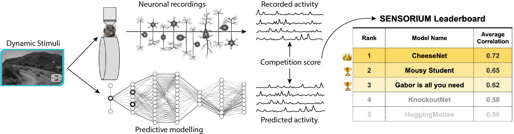

# SENSORIUM 2023 Competition

SENSORIUM is a competition on predicting large scale mouse primary visual cortex activity. We will provide large scale datasets of neuronal activity in the visual cortex of mice. Participants will train models on pairs of natural stimuli and recorded neuronal responses, and submit the predicted responses to a set of test images for which responses are withheld. 
